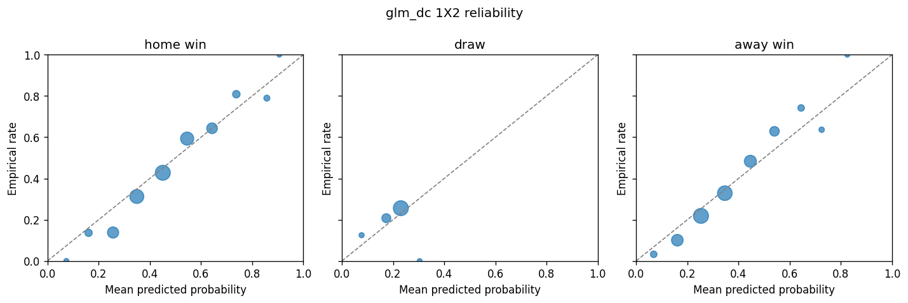

# xg-edge — вероятностная модель исходов футбольных матчей

[](https://github.com/bogdasovandrej/xg-edge/actions/workflows/ci.yml)


Квантитативный кейс: калиброванные вероятности рынков **1X2 / тоталы / BTTS / точный счёт**
из xG-статистики (Dixon–Coles поверх двойного Пуассона), с walk-forward-валидацией
без утечки будущего, реестром фальсифицируемых гипотез и честной проверкой
главного вопроса: **есть ли у модели эдж против закрывающей линии букмекера?**

**Короткий ответ: нет — и модель корректно это диагностирует.** Средний CLV на
out-of-sample: **−6.8%** (95% CI [−7.3%, −6.3%]). Это ожидаемый и научно
содержательный результат: закрывающая линия Pinnacle — очень сильный агрегатор
информации, и проект демонстрирует *методологию*, которая не позволяет принять
шум за эдж.

---

## 1. Постановка задачи

Построить вероятностную модель исходов матчей АПЛ, продукт которой — не «прогноз
победителя», а **калиброванное распределение вероятностей** по счетам, из
которого агрегируется любой рынок. Критерии успеха зафиксированы до начала
работы (см. [реестр гипотез](docs/hypotheses.md)):

1. **Калибровка**: Brier и log-loss лучше трёх бейзлайнов (равные вероятности,
   голый Пуассон по средним голам, рыночные вероятности из закрывающей линии);
   reliability-диаграмма близка к диагонали.
2. **Эдж**: средний CLV (closing line value) > 0 на out-of-sample.
3. **Протокол**: walk-forward без утечки будущего; каждая метрика в модели
   прошла процедуру допуска.

Угаданные матчи, ROI на короткой дистанции и «чуйка» доказательствами не
являются. Гипотеза без критерия провала — запрещена.

## 2. Данные

| Источник | Что даёт | Роль |
|---|---|---|
| [Understat](https://understat.com) | xG, npxG, PPDA, deep completions по матчам | основной источник xG |
| [football-data.co.uk](https://www.football-data.co.uk) | результаты, карточки, коэффициенты Bet365/Pinnacle — предзакрытие **и закрытие** | без закрывающих линий нет CLV |

Охват: **АПЛ, 5 сезонов 2021/22–2025/26, 1900 матчей**, join двух источников —
100% (канонический словарь имён команд, `src/xgedge/data/teams.py`).

Инженерные правила (см. [docs/data.md](docs/data.md)):

- **Слои `raw → cleaned → features`**: сырые данные неизменяемы, любая
  трансформация воспроизводима скриптом.
- **Никакой утечки будущего**: каждый признак вычислим строго до стартового
  свистка; рейтинги команд считаются *до* добавления матча в историю.
- Understat с конца 2025 отдаёт данные через JSON-эндпоинт
  `GET /getLeagueData/{league}/{year}` — старый парсинг встроенных в HTML блобов
  мёртв; загрузчик использует новый API (находка этого проекта).

## 3. Методология

```
raw (fd CSV + understat JSON, неизменяемые)
  └─► cleaned  (канонические ID, join 1:1, 1900 матчей)
        └─► features (xG-рейтинги атаки/обороны: time-decay, венный сплит)
              └─► model    (Пуассон-GLM → λ_home, λ_away → Dixon–Coles τ)
                    └─► markets  (матрица счетов → 1X2 / тоталы / BTTS / АФ)
                          └─► decision (EV-фильтр → дробный Келли ≤2% банка)
                                └─► evaluation (Brier, log-loss, reliability, CLV, drawdown)
```

- **Ядро** — двойной Пуассон с τ-коррекцией Диксона–Коулза (низкие счета);
  ρ профилируется на train каждого окна.
- **λ из xG-признаков, не из голов**: рейтинги — экспоненциально затухающие
  средние xG за/против (полураспад 180 дней — подобран на валидации),
  с понижением веса матчей с удалениями и домашним/выездным сплитом.
- **Слой признаков → λ**: Пуассон-GLM (бейзлайн) против градиентного бустинга
  (претендент). Претендент принимается только если бьёт GLM по log-loss на
  walk-forward. *Не побил — GLM остаётся* (0.9875 против 0.9827).
- **Walk-forward**: обучение на всём прошлом → прогноз следующего 30-дневного
  окна → сдвиг. Тестовый период — три полных сезона (2023/24–2025/26,
  1120 матчей out-of-sample). Никаких случайных train/test-разбиений: время в
  футболе не перемешивается.
- **Процедура допуска метрик**: одна метрика = одна гипотеза с порогом провала;
  A/B на walk-forward; провал документируется, а не «дожимается» (раздел 5).
- **Ставочный контур**: EV-фильтр (порог 3%) по ценам *предзакрытия* Bet365,
  дробный Келли ¼ с потолком 2% банка; CLV считается против закрывающей линии
  Pinnacle, очищенной от маржи методом Шина.

## 4. Результаты

### Калибровка: модель бьёт все нерыночные бейзлайны

1X2, walk-forward out-of-sample (n = 1120; `*` — общее подмножество n = 950,
где есть и закрывающие линии):

| Модель | Brier ↓ | Log-loss ↓ | Brier\* | Log-loss\* |
|---|---|---|---|---|
| **glm_dc (наша)** | **0.5835** | **0.9827** | **0.5737** | **0.9692** |
| gbm_dc (претендент) | 0.5869 | 0.9875 | 0.5766 | 0.9728 |
| dc_classic (по голам) | 0.5884 | 0.9879 | 0.5769 | 0.9720 |
| goals_poisson (бейзлайн б) | 0.5938 | 0.9956 | 0.5806 | 0.9775 |
| uniform (бейзлайн а) | 0.6667 | 1.0986 | 0.6667 | 1.0986 |
| **market (бейзлайн в)** | **0.5607** | **0.9468** | 0.5607 | 0.9468 |

На тотале 2.5 картина та же: glm_dc 0.2419 (Brier) против 0.2438 у голого
Пуассона и 0.2383 у рынка.



Домашние и гостевые победы сидят на диагонали; вероятности ничьих модель, как и
положено пуассоновскому ядру, держит в узком коридоре ~20–30%.

### Реестр гипотез: что подтвердилось, а что провалилось

Абляции на том же walk-forward-протоколе ([reports/hypotheses.md](reports/hypotheses.md)):

| Гипотеза | Механизм | Δ log-loss без него | Вердикт |
|---|---|---|---|
| **H8** | time-decay весов матчей | **+0.0105** | ✅ подтверждена |
| H2 | нормировка xG на силу соперника | −0.0020 | ❌ провалена |
| H7 | npxG вместо сырого xG | −0.0023 | ❌ провалена |
| H9 | τ-коррекция Диксона–Коулза (на 1X2) | ~0.0000 | ⚪ вклада нет; эффект остаётся только для рынка точного счёта |
| — | полураспад 90д / 365д вместо 180д | +0.0027 / +0.0021 | 180д — локальный оптимум |

Это процедура допуска в действии: два правдоподобных механизма (H2, H7) не
заработали место в модели — они **задокументированы как провалившиеся**, а не
удалены молча и не «дожаты» переподбором окна. Подтверждение их провала на
следующем сезоне — вне периода, где вердикт вынесен, — условие финального
исключения из контура.

### Главная гипотеза H10: эдж против закрывающей линии — провалена

| Показатель | Значение |
|---|---|
| Ставок с «эджем» ≥ 3% по модели | 1583 |
| ROI (Келли ¼, потолок 2%) | **−4.8%** |
| ROI (флэт) | −5.8% |
| Средний CLV | **−6.8%** [−7.3%, −6.3%] |
| Доля ставок с CLV > 0 | 17.7% |

Модель калибрована, но **менее информативна, чем закрывающая линия** (log-loss
0.9692 против 0.9468 на общем подмножестве). Поэтому расхождения «модель против
рынка» — в основном наш шум, и отбор по ним даёт отрицательную селекцию: рынок
закрывается *против* наших ставок в 82% случаев. По зафиксированному критерию
(CLV ≤ 0 → эджа нет, что бы ни показывал ROI) **H10 провалена**.

## 5. Выводы

1. **Методология работает**: пайплайн без утечки будущего, честные бейзлайны и
   walk-forward дали воспроизводимую, калиброванную модель, которая бьёт все
   наивные бейзлайны — включая классический Dixon–Coles по голам (xG-признаки
   дают измеримый вклад: 0.9827 против 0.9879).
2. **Рынок — сильный конкурент**, ровно как постулировалось: закрывающая линия
   Pinnacle информативнее модели на публичных данных. Эджа нет, и система
   мониторинга (CLV) диагностирует это за пределами любых иллюзий ROI.
3. **Провал гипотез — информация**: нормировка на соперника и npxG не дали
   вклада на этих данных; time-decay — дал. Бюджет сложности (≤8–12 признаков
   на сезон) соблюдён.

## 6. Бизнес-ценность

- **Прямая**: каркас для решений под неопределённостью — калиброванные
  вероятности + жёсткая валидация переносимы на любые вероятностные продукты
  (кредитный скоринг, прогноз спроса, ценообразование риска). «Футбол» здесь —
  просто честный полигон с ежедневной разметкой и сильным рыночным бенчмарком.
- **Отрицательный результат экономит деньги**: система, которая *доказуемо*
  отличает эдж от шума, — это защита капитала. Вывод «не ставить» на этих
  данных стоит больше, чем красивый бэктест.
- **Инфраструктурная**: воспроизводимый data-контур (raw→cleaned→features,
  контракт колонок, 91 тест, CI) — образец продакшн-дисциплины для
  аналитических пайплайнов.

## 7. Ограничения и roadmap

- Одна лига (АПЛ) и 5 сезонов; составы, травмы, судьи и движение линии не
  параметризованы (ярусы 2–3 реестра метрик — [docs/metrics-registry.md](docs/metrics-registry.md)).
- Минутные xG-мультипликаторы удалений требуют event-данных (StatsBomb Open
  Data — полигон следующей итерации).
- Гипотезы H12–H20 (xG per shot, PSxG−GA вратаря, стандарты против игры с хода,
  PPDA→тоталы и др.) сформулированы с порогами провала и ждут прогона.
- Кросс-валидация xG против второго поставщика (FBref/Opta) — расхождение
  фиксируется как признак, не усредняется молча.

## 8. Воспроизведение

```bash
git clone https://github.com/bogdasovandrej/xg-edge && cd xg-edge
python -m venv .venv && .venv/Scripts/activate        # Windows
pip install -e ".[dev]"
pytest                                                 # 91 тест, без сети
python scripts/download_data.py                        # raw: fd CSV + understat JSON
python scripts/build_dataset.py                        # cleaned: 1900 матчей
python scripts/run_walkforward.py                      # метрики, reliability, CLV
python scripts/run_hypotheses.py                       # абляции H2/H7/H8/H9
```

Все отчёты пишутся в `reports/` (закоммичены для просмотра без прогона).

## 9. Структура репозитория

```
src/xgedge/
  contracts.py        # единый контракт колонок и путей
  data/               # загрузчики (fd, understat), словарь команд, сборка cleaned
  features/           # xG-рейтинги: time-decay, венный сплит, допуск метрик
  models/             # Пуассон-GLM, GBM-претендент, Dixon–Coles, бейзлайны
  markets/            # матрица счетов → 1X2, тоталы, BTTS, азиатские форы
  decision/           # демаржинация (Шин), EV-фильтр, дробный Келли
  evaluation/         # walk-forward, Brier/log-loss, reliability, CLV
  pipeline.py         # оркестрация walk-forward-прогона
scripts/              # download → build → run_walkforward → run_hypotheses
docs/                 # реестр гипотез, реестр метрик, контракт данных
tests/                # 91 тест: свойства, ноль сети, синтетический e2e
reports/              # результаты прогонов (закоммичены)
```

---

**Дисклеймер**: учебно-исследовательский проект по спортивной аналитике.
Не является рекомендацией по ставкам; собственный вывод проекта — у модели на
публичных данных **нет** преимущества над рынком.
